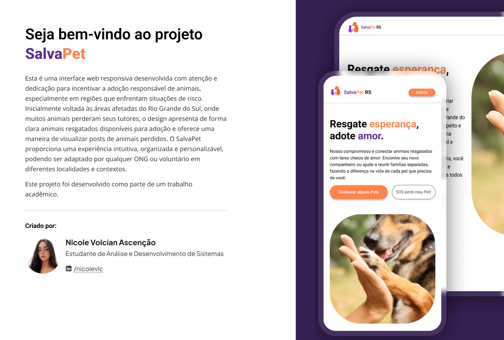

# 🐾 SalvaPet RS: Interface para Adoção e Reencontro de Animais Resgatados

  
    

O "SalvaPet" é uma **interface visual** desenvolvida para incentivar a **adoção responsável** e facilitar o **reencontro** de animais resgatados, inicialmente focada nas comunidades afetadas pelas enchentes no Rio Grande do Sul.

A interface foi pensada para ser **reutilizável e personalizável**, permitindo que qualquer pessoa, grupo ou ONG adapte o layout visual para divulgar animais em sua própria região.

## 💡 Objetivos

* **Disponibilizar** uma interface visual clara e acessível para exibição de informações sobre animais resgatados (fotos, descrições e dados de contato).
* **Apresentar** os animais em um layout de cards organizado.
* **Fornecer** um layout reutilizável e personalizável por diferentes regiões afetadas.

## 💻 Tecnologias de Desenvolvimento

Este projeto de interface foi desenvolvido usando:

* **Figma** (Para prototipagem e design)
* **Canva**

## 🎨 Protótipo e Design

O protótipo da interface foi criado no Figma, para ter acesso ao protótipo do projeto clique [aqui](https://www.figma.com/proto/OQzlcOmfG3XT2b4NnfNNl3/Projeto-de-Interface-do-SalvaPet-RS?node-id=0-1&t=mD5bFMJjPKMHRzmC-1).

Você pode visualizar e interagir com o design completo [aqui](https://www.figma.com/community/file/1553526653365981327)
